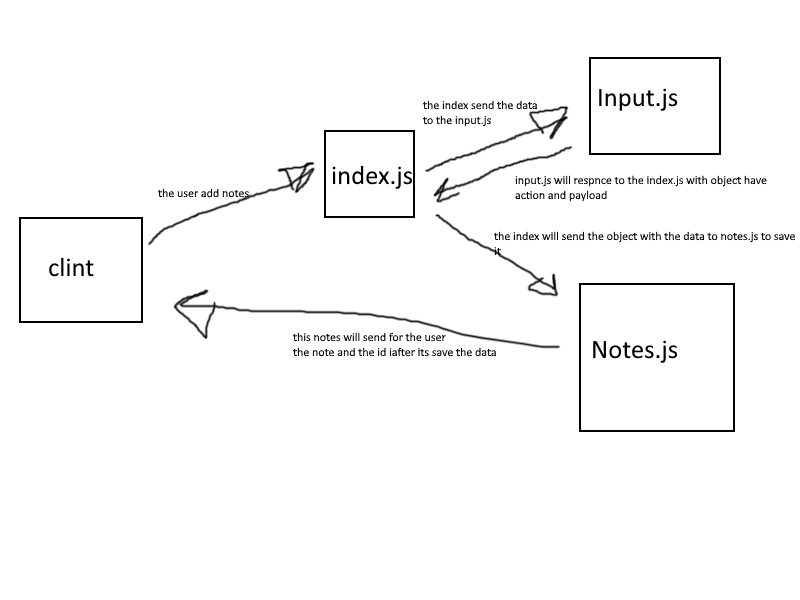
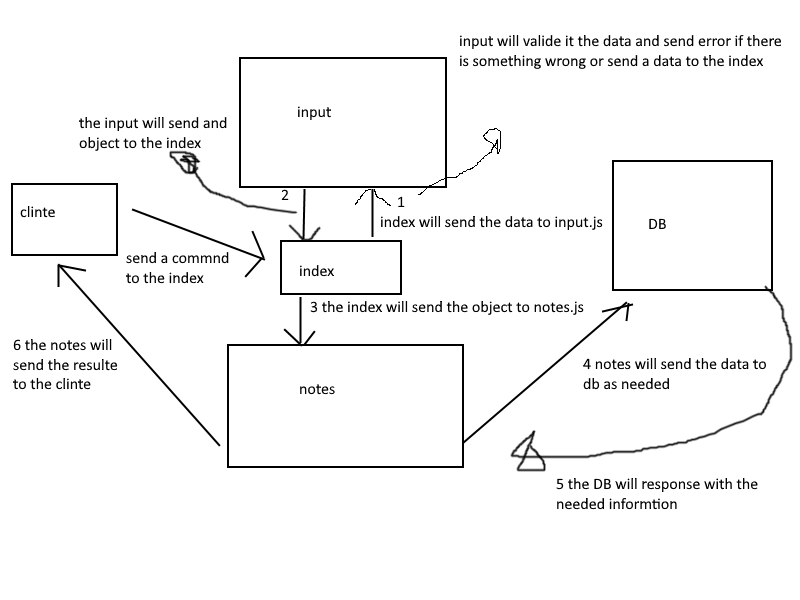

# notes

## Class-01

#### feature requirements
1. allow the user to add notes using command line
2. response with error if there is one or response with the notes to confirem that its add it 

### PR

`https://github.com/YazanAlaiwah-401-advanced-javascript/notes/pull/1`

#### UML

## Class-02

### Project: Notes

### PR 
`https://github.com/YazanAlaiwah-401-advanced-javascript/notes/pull/2`

#### feature requirements
1. add test for our project
2. refactor the project to ECMA 6 class

### PR

#### UML

## Class-03

### Project: Notes

### PR 
`https://github.com/YazanAlaiwah-401-advanced-javascript/notes/pull/3`

#### feature requirements
1. add the notes to the database
2. using CRUD to the database

#### UML

