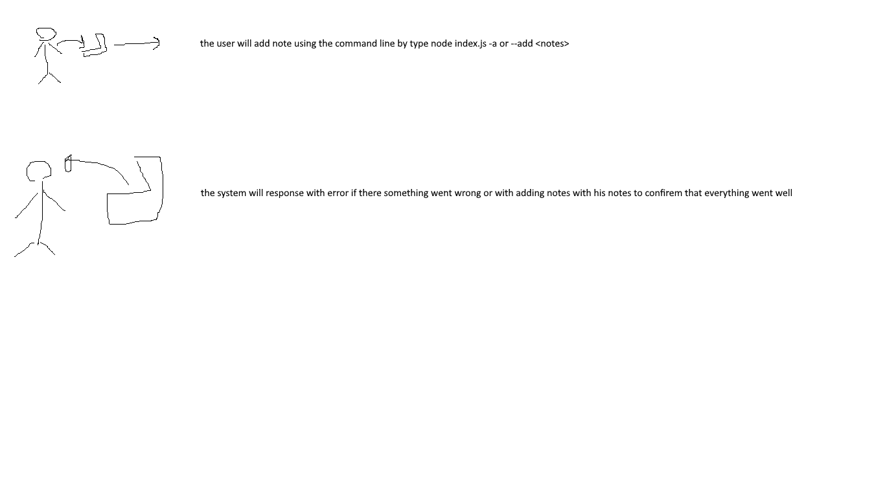

# notes

## Class-01

#### feature requirements
1. allow the user to add notes using command line
2. response with error if there is one or response with the notes to confirem that its add it 

### PR

`https://github.com/YazanAlaiwah-401-advanced-javascript/notes/pull/1`

#### UML

